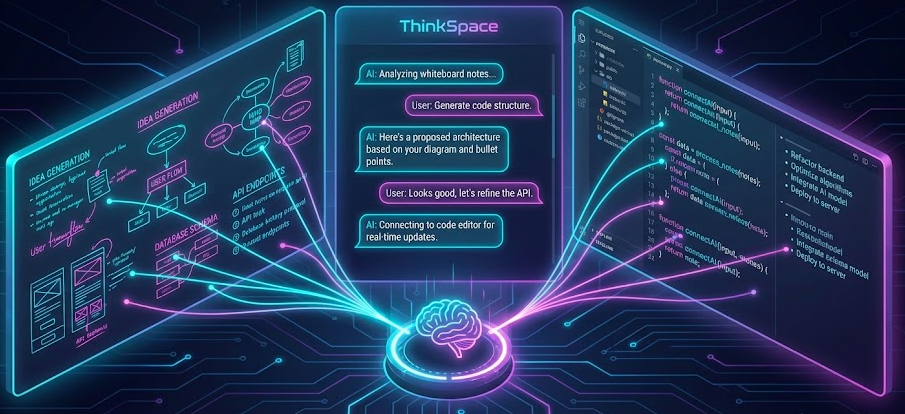

# ThinkSpace 🧠

**Independent Learning Environment — Built because I was tired of repeating myself to AI every conversation.**

A context-aware AI learning assistant that remembers your journey, milestones, and breakthroughs — no more starting from zero each chat session.




---

## The Problem 😤

Tired of having to:
- Re-explain your goals and context to AI every conversation
- Lose track of insights and breakthroughs between sessions
- Start learning journeys over and over again
- Work with AI that doesn't understand your working style or preferences

## The Solution ✨

Seamless AI conversations with **persistent context**:

- 🧠 **Memory that matters** — Milestones, insights, and breakthroughs are automatically preserved
- 🔄 **Session continuity** — Pick up exactly where you left off, even after chat resets
- 🎯 **Personalized experience** — AI learns your preferences, working style, and goals
- 📚 **Learning journey tracking** — See your progress and remember your "aha!" moments

---

## Key Features

### 🤖 Starter AI Agents

Includes 8 pre-configured agents for learning and content creation:

- **Curriculum Architect** — Structures learning paths
- **Socratic Questioner** — Guided discovery through questions
- **Visual Storyteller** — Analogies and mental models
- **Practice Designer** — Exercises and quizzes
- **Research Specialist** — Information gathering
- **Strategic Planner** — Task breakdown and planning
- **Content Writer** — Clear, engaging writing
- **Quality Reviewer** — Feedback and improvements

*Create your own custom agents in the app!*

### 📊 Interactive Tools

- **K-Factor Calculator** — Viral coefficient and growth projections
- **Pricing Calculator** — Psychology-based pricing optimization
- **Study Guide Generator** — AI-powered learning materials
- **Visual Learning Canvas** — Interactive brainstorming and mind mapping
- **Kanban Board** — Task management built for ADHD minds
- **Hyperfocus Timer** — Productivity tracking

### 🎨 Beautiful, Accessible UI

- Dark mode by default
- ADHD-friendly design (reduced cognitive load)
- Smooth animations with Framer Motion
- Invisible sidebar for distraction-free work

---

## Tech Stack

| Layer | Technology |
|-------|------------|
| Frontend | React 18, TypeScript, TailwindCSS, Framer Motion |
| Backend | Tauri (Rust), SQLite |
| AI | MiniMax, OpenAI, Claude (bring your own key) |
| Cloud (optional) | Supabase |
| Vector Storage | Qdrant (for semantic memory) |

---

## Quick Start 🚀

### Prerequisites
- Node.js 18+
- Rust ([install](https://rustup.rs))
- Tauri CLI: `cargo install tauri-cli`

### Installation

```bash
git clone https://github.com/oogalieboogalie/ThinkSpace.git
cd ThinkSpace
npm install
```

### Configuration

```bash
cp .env.example .env
# Add your API keys to .env
```

### Run

```bash
npm run tauri dev
```

### Build

```bash
npm run tauri build
# Outputs: .exe (Windows), .dmg (macOS), .deb/.AppImage (Linux)
```

---

## Why I Built This 💡

After years of using AI assistants, I realized the biggest pain point wasn't the AI's capabilities — it was the **lack of continuity**. Every conversation felt like starting from scratch, even when I was working on the same complex project for weeks.

This learning environment was my attempt to solve that fundamental UX problem. Now our conversations can build on each other, and the AI actually gets my context without me having to re-explain everything.

---

## Architecture

```
┌─────────────────┐    ┌─────────────────┐    ┌─────────────────┐
│   Tauri App     │────│   Rust Backend  │────│  Vector Store   │
│  (React/TS)     │    │  (SQLite/APIs)  │    │  (Qdrant)       │
└─────────────────┘    └─────────────────┘    └─────────────────┘
                              │
                       ┌─────────────────┐
                       │   AI Services   │
                       │ (MiniMax/OpenAI)│
                       └─────────────────┘
```

---

## Contributing 🤝

This is an open source project born from real developer frustration. Contributions are welcome!

See [CONTRIBUTING.md](CONTRIBUTING.md) for guidelines.

---

## License 📄

MIT License — see [LICENSE](LICENSE) for details.

---

## Roadmap 🗺️

- [ ] Web interface for memory browsing
- [ ] Export/import learning journeys
- [ ] Team collaboration features
- [ ] Custom importance scoring models
- [ ] Plugin ecosystem for different AI providers

---

**Built with ❤️ by a developer who refused to accept "reset conversation" as the only option.**
